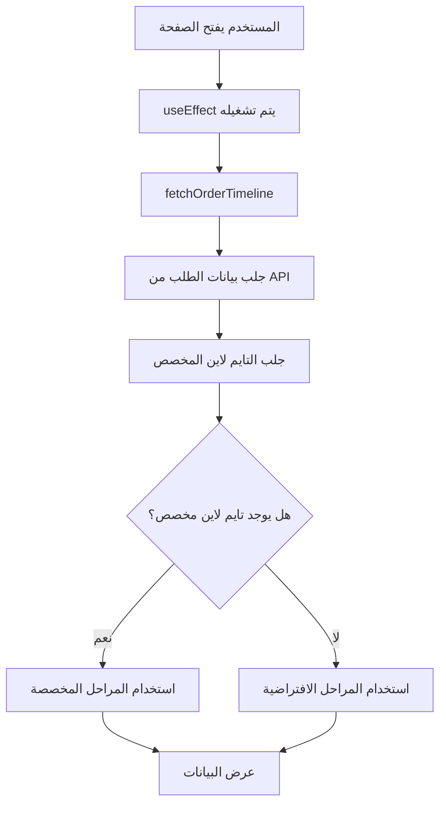

# دليل صفحة تتبع الطلب للعميل (Client Timeline Page)

## 📋 نظرة عامة

صفحة `/admin/client/[id]` هي صفحة اختبار لعرض التايم لاين الديناميكي للطلبات. تعرض هذه الصفحة حالة الطلب بشكل مرئي مع دعم التايم لاين المخصص لكل دولة.

---

## 🎯 الهدف من الصفحة

- عرض حالة الطلب بشكل مرئي وواضح
- دعم التايم لاين المخصص لكل دولة
- عرض معلومات العميل والعاملة
- تتبع تقدم المراحل بشكل ديناميكي

---

## 📁 الموقع

```
pages/admin/client/[id].tsx
```

**المسار**: `/admin/client/{orderId}`

**مثال**: `/admin/client/142`

---

## 🏗️ البنية والهيكل

### 1. Interfaces (الواجهات)

#### `TimelineStage`
```typescript
interface TimelineStage {
  label: string;      // اسم المرحلة بالعربية
  field: string;       // اسم الحقل في قاعدة البيانات
  order: number;       // ترتيب المرحلة
  icon?: string;       // اسم الأيقونة (اختياري)
}
```

#### `OrderData`
```typescript
interface OrderData {
  orderId: string;
  clientInfo: { id?: string; name: string; phone: string; email: string };
  homemaidInfo: { id: string; name: string; passportNumber: string; nationality: string; externalOffice: string };
  nationality?: string;
  customTimelineStages?: { [key: string]: { completed: boolean; date: string | null } };
  // ... باقي الحقول
}
```

#### `CustomTimeline`
```typescript
interface CustomTimeline {
  id: number;
  country: string;
  name: string | null;
  stages: TimelineStage[];
  isActive: boolean;
}
```

---

## 🔄 آلية العمل (Flow)

### 1. تحميل الصفحة



### 2. دالة `fetchOrderTimeline`

```typescript
const fetchOrderTimeline = async () => {
  // 1. جلب بيانات الطلب
  const orderRes = await fetch(`/api/track_order/${id}`);
  const order = await orderRes.json();
  
  // 2. جلب التايم لاين المخصص بناءً على الجنسية
  if (order.nationality) {
    const timelineRes = await fetch(
      `/api/custom-timeline/by-country/${encodeURIComponent(order.nationality)}`
    );
    if (timelineRes.ok) {
      timeline = await timelineRes.json();
    }
  }
  
  // 3. تحديد المراحل (مخصصة أو افتراضية)
  if (timeline && timeline.isActive) {
    setStages([...timeline.stages].sort((a, b) => a.order - b.order));
  } else {
    setStages(DEFAULT_STAGES);
  }
}
```

**الخطوات**:
1. جلب بيانات الطلب من `/api/track_order/{id}`
2. استخراج جنسية العاملة من `order.nationality`
3. البحث عن تايم لاين مخصص للدولة من `/api/custom-timeline/by-country/{country}`
4. إذا وُجد تايم لاين نشط → استخدامه
5. إذا لم يوجد → استخدام المراحل الافتراضية

---

## 🎨 دوال العرض والتحويل

### 1. `getIconComponent`

**الوظيفة**: تحويل اسم الأيقونة إلى مكون React

```typescript
const getIconComponent = (iconName?: string) => {
  const iconMap = {
    'Link': <Link className="w-5 h-5" />,
    'Briefcase': <Briefcase className="w-5 h-5" />,
    'Stethoscope': <FaStethoscope className="w-5 h-5" />,
    // ... إلخ
  };
  return iconMap[iconName] || <CheckCircle className="w-5 h-5" />;
}
```

**الأيقونات المدعومة**:
- `Link` - الربط
- `Briefcase` - المكتب
- `CheckCircle` - الموافقة
- `Stethoscope` - الفحص الطبي
- `DollarSign` - الدفع
- `Flag` - السفارة/الموافقات
- `Plane` - السفر
- `MapPin` - الوجهات
- `Package` - الاستلام
- `FileText` - المستندات

---

### 2. `getStageStatus`

**الوظيفة**: تحديد حالة المرحلة (مكتملة/نشطة/قيد الانتظار)

```typescript
const getStageStatus = (stage: TimelineStage): 'completed' | 'active' | 'pending' => {
  // أولاً: التحقق من customTimelineStages
  if (orderData.customTimelineStages?.[stage.field]?.completed) {
    return 'completed';
  }
  
  // ثانياً: Mapping للحقول الافتراضية
  const fieldMap = {
    officeLinkInfo: !!orderData.officeLinkInfo,
    medicalCheck: orderData.medicalCheck?.passed || false,
    visaIssuance: orderData.visaIssuance?.issued || false,
    // ... إلخ
  };
  
  return fieldMap[stage.field] ? 'completed' : 'pending';
}
```

**آلية العمل**:
1. التحقق أولاً من `customTimelineStages` (للمراحل المخصصة)
2. إذا لم يوجد، البحث في الحقول الافتراضية
3. إرجاع `completed` أو `pending`

---

### 3. `getActiveStageIndex`

**الوظيفة**: تحديد المرحلة النشطة الحالية

```typescript
const getActiveStageIndex = (): number => {
  for (let i = 0; i < stages.length; i++) {
    const status = getStageStatus(stages[i]);
    if (status === 'pending') {
      return i; // أول مرحلة غير مكتملة
    }
  }
  return stages.length - 1; // كل المراحل مكتملة
}
```

**المنطق**: 
- المرحلة النشطة = أول مرحلة غير مكتملة
- إذا كانت كل المراحل مكتملة → آخر مرحلة

---

## 🎨 واجهة المستخدم (UI Components)

### 1. Header Section

```tsx
<div className="mb-8">
  <h1>طلب #{orderData.orderId}</h1>
  <p>
    {customTimeline && customTimeline.isActive
      ? `جدول زمني مخصص: ${customTimeline.name || customTimeline.country}`
      : 'جدول زمني افتراضي'}
  </p>
</div>
```

**يعرض**:
- رقم الطلب
- نوع التايم لاين (مخصص/افتراضي)

---

### 2. Timeline Display

```tsx
{stages.map((stage, index) => {
  const status = getStageStatus(stage);
  const isCompleted = status === 'completed';
  const isActive = index === activeIndex && !isCompleted;
  
  return (
    <div>
      {/* Icon Circle */}
      <div className={isCompleted ? 'bg-teal-800' : isActive ? 'bg-teal-600' : 'bg-white'}>
        {isCompleted ? <CheckCircle2 /> : getIconComponent(stage.icon)}
      </div>
      {/* Stage Label */}
      <p>{stage.label}</p>
    </div>
  );
})}
```

**الألوان**:
- 🟢 **مكتملة**: `bg-teal-800` (أخضر داكن)
- 🔵 **نشطة**: `bg-teal-600` (أزرق) + `animate-pulse`
- ⚪ **قيد الانتظار**: `bg-white` (أبيض)

---

### 3. Order Information Cards

#### معلومات العميل
- الاسم
- الهاتف
- البريد الإلكتروني
- رقم الطلب

#### معلومات العاملة
- الاسم
- رقم جواز السفر
- الجنسية
- المكتب الخارجي

---

### 4. Stages Details Grid

```tsx
<div className="grid grid-cols-1 md:grid-cols-2 lg:grid-cols-3 gap-4">
  {stages.map((stage, index) => (
    <div className={isCompleted ? 'border-teal-800 bg-teal-50' : 'border-gray-200'}>
      <h4>{stage.label}</h4>
      <span>{isCompleted ? 'مكتملة' : 'قيد الانتظار'}</span>
    </div>
  ))}
</div>
```

**يعرض**: تفاصيل كل مرحلة مع حالتها

---

## 🔌 API Endpoints المستخدمة

### 1. `GET /api/track_order/{id}`

**الوظيفة**: جلب بيانات الطلب الكاملة

**Response**:
```json
{
  "orderId": "142",
  "clientInfo": { "name": "...", "phone": "...", "email": "..." },
  "homemaidInfo": { "name": "...", "passportNumber": "...", "nationality": "..." },
  "nationality": "مصر",
  "customTimelineStages": {
    "medicalCheck": { "completed": true, "date": "2024-01-15" }
  },
  // ... باقي الحقول
}
```

---

### 2. `GET /api/custom-timeline/by-country/{country}`

**الوظيفة**: جلب التايم لاين المخصص للدولة

**Response**:
```json
{
  "id": 1,
  "country": "مصر",
  "name": "تايم لاين مصر 2024",
  "stages": [
    { "label": "الفحص الطبي", "field": "medicalCheck", "order": 0, "icon": "Stethoscope" }
  ],
  "isActive": true
}
```

**Error**: إذا لم يوجد → `404`

---

## 📊 Mapping الحقول

### الحقول الافتراضية

| Field Name | OrderData Path | Type |
|------------|----------------|------|
| `officeLinkInfo` | `orderData.officeLinkInfo` | Object |
| `externalOfficeInfo` | `orderData.externalOfficeInfo` | Object |
| `externalOfficeApproval` | `orderData.externalOfficeApproval?.approved` | Boolean |
| `medicalCheck` | `orderData.medicalCheck?.passed` | Boolean |
| `foreignLaborApproval` | `orderData.foreignLaborApproval?.approved` | Boolean |
| `agencyPayment` | `orderData.agencyPayment?.paid` | Boolean |
| `saudiEmbassyApproval` | `orderData.saudiEmbassyApproval?.approved` | Boolean |
| `visaIssuance` | `orderData.visaIssuance?.issued` | Boolean |
| `travelPermit` | `orderData.travelPermit?.issued` | Boolean |
| `destinations` | `orderData.destinations` | Object |
| `receipt` | `orderData.receipt?.received` | Boolean |
| `documentUpload` | `orderData.documentUpload?.files` | Array/String |

### الحقول المخصصة

يتم التحقق من `orderData.customTimelineStages[fieldName].completed`

---

## 🎯 المراحل الافتراضية

```typescript
const DEFAULT_STAGES = [
  { label: 'الربط مع إدارة المكاتب', field: 'officeLinkInfo', order: 0, icon: 'Link' },
  { label: 'المكتب الخارجي', field: 'externalOfficeInfo', order: 1, icon: 'Briefcase' },
  { label: 'موافقة المكتب الخارجي', field: 'externalOfficeApproval', order: 2, icon: 'CheckCircle' },
  { label: 'الفحص الطبي', field: 'medicalCheck', order: 3, icon: 'Stethoscope' },
  { label: 'موافقة وزارة العمل الأجنبية', field: 'foreignLaborApproval', order: 4, icon: 'Flag' },
  { label: 'دفع الوكالة', field: 'agencyPayment', order: 5, icon: 'DollarSign' },
  { label: 'موافقة السفارة السعودية', field: 'saudiEmbassyApproval', order: 6, icon: 'Flag' },
  { label: 'إصدار التأشيرة', field: 'visaIssuance', order: 7, icon: 'Plane' },
  { label: 'تصريح السفر', field: 'travelPermit', order: 8, icon: 'Plane' },
  { label: 'الوجهات', field: 'destinations', order: 9, icon: 'MapPin' },
  { label: 'الاستلام', field: 'receipt', order: 10, icon: 'Package' },
  { label: 'رفع المستندات', field: 'documentUpload', order: 11, icon: 'FileText' },
];
```

---

## 🔍 حالات التحميل والأخطاء

### 1. Loading State

```tsx
if (loading) {
  return (
    <div className="flex justify-center items-center">
      <div className="animate-spin rounded-full h-16 w-16 border-b-2 border-teal-900"></div>
      <span>جاري التحميل...</span>
    </div>
  );
}
```

---

### 2. Error State

```tsx
if (error || !orderData) {
  return (
    <div>
      <p className="text-red-600">{error || 'الطلب غير موجود'}</p>
      <button onClick={() => router.push('/admin/home')}>
        العودة للصفحة الرئيسية
      </button>
    </div>
  );
}
```

---

## 🧪 معلومات التصحيح (Debug Info)

```tsx
<div className="bg-gray-100 rounded-lg p-4">
  <h4>معلومات التصحيح:</h4>
  <p>الطلب ID: {id}</p>
  <p>الجنسية: {orderData.nationality || 'غير محدد'}</p>
  <p>عدد المراحل: {stages.length}</p>
  <p>المرحلة النشطة: {activeIndex + 1}</p>
  <p>نوع التايم لاين: {customTimeline && customTimeline.isActive ? 'مخصص' : 'افتراضي'}</p>
</div>
```

**يستخدم للاختبار**: يعرض معلومات مفيدة للمطورين

---

## 📝 أمثلة الاستخدام

### مثال 1: طلب مع تايم لاين مخصص

```
1. المستخدم يفتح /admin/client/142
2. النظام يجلب بيانات الطلب
3. الجنسية: "مصر"
4. البحث عن تايم لاين مخصص لمصر
5. وُجد تايم لاين نشط → استخدامه
6. عرض المراحل المخصصة مع حالتها
```

---

### مثال 2: طلب بدون تايم لاين مخصص

```
1. المستخدم يفتح /admin/client/100
2. النظام يجلب بيانات الطلب
3. الجنسية: "الفلبين"
4. البحث عن تايم لاين مخصص للفلبين
5. لم يوجد → استخدام المراحل الافتراضية
6. عرض المراحل الافتراضية مع حالتها
```

---

## 🎨 التصميم والألوان

### Color Scheme

- **Primary**: `teal-800` (أخضر داكن)
- **Active**: `teal-600` (أزرق)
- **Completed**: `green-500` (أخضر)
- **Pending**: `gray-300` (رمادي)

### Responsive Design

- **Mobile**: `grid-cols-1`
- **Tablet**: `md:grid-cols-2`
- **Desktop**: `lg:grid-cols-3`

---

## 🔧 التطوير والتحسينات المستقبلية

### إضافات مقترحة:

1. **إضافة تفاصيل أكثر لكل مرحلة**
   - تاريخ الإكمال
   - الملفات المرفقة
   - الملاحظات

2. **إضافة إشعارات**
   - إشعار عند اكتمال مرحلة
   - إشعار عند تغيير الحالة

3. **إضافة تصدير PDF**
   - تصدير حالة الطلب كـ PDF

4. **إضافة تحديث تلقائي**
   - Polling للتحقق من التحديثات

---

## 📚 المراجع

- [صفحة إدارة التايم لاين](./manage-timeline.md)
- [API Documentation](./api-docs.md)
- [Database Schema](./database-schema.md)

---

## ✅ الخلاصة

صفحة `/admin/client/[id]` توفر:
- ✅ عرض ديناميكي للتايم لاين
- ✅ دعم التايم لاين المخصص
- ✅ واجهة مستخدم واضحة
- ✅ معلومات تفصيلية للطلب
- ✅ معلومات تصحيح للمطورين

---

**آخر تحديث**: 2024

